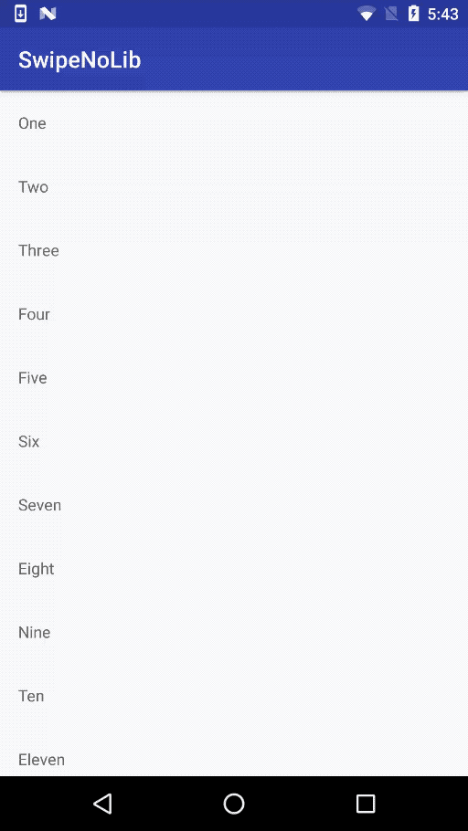

# SwipeNoLib
A very simple implementation of a RecyclerView ItemTouchHelper. 

[  ](https://bintray.com/gryzor/SwipeNoLib/SwipeNoLib/_latestVersion)

Adding swipe to RecyclerView cells doesn't need a lot of code, you don't need a library, hence why this library exists… `¯\_(ツ)_/¯`



There are only two classes involved: `RecyclerViewItemSwipeHelper` and `RecyclerViewSwipeHelperDecorator`. 

The former is the one that deals with the touch, drag and drawing of the background; the later is in charge of drawing a background after an item has been removed. Only the Swipe helper is needed, the decorator is optional.

# How To Use?

1. Add the Gradle dependency:

```
compile 'com.github.gryzor:swipenolib:1.0.0'
```

2. Use the supplied Builder to construct an instance of the swipe helper like so:

```
        new RecyclerViewItemSwipeHelper.Builder()
                .setBackgroundColor(new ColorDrawable(Color.RED))
                .setSwipeListener(new RecyclerViewItemSwipeHelper.OnSwipeListener() {
                    @Override
                    public void onItemSwiped(final int position) {
                        // Do whatever you want, like recyclerViewAdapter.remove(position)
                    }
                })
                .swipeToStart()
                .setDeleteImageColor(Color.WHITE)
                .disableSwipeOnPositions(0)
                .disableSwipeOnLastItem()
                .buildAndAttach(this, recyclerView);
```

Additionally you can build and attach later by using:

```
ItemTouchHelper helper = new RecyclerViewItemSwipeHelper.Builder()
						...
						.build(this);

helper.attachToRecyclerView(recyclerView);
```

If you also want the benefit from the decorator to animate the background color while RecyclerView is animating its childs, then you need to:

```
        new RecyclerViewSwipeHelperDecorator.Builder()
                .setBackgroundColor(new ColorDrawable(Color.RED))
                .buildAndAdd(recyclerView);
```

or if you want to pre-build this and then add it, you can:

```
        RecyclerView.ItemDecoration decorator = new RecyclerViewSwipeHelperDecorator.Builder()
                .setBackgroundColor(new ColorDrawable(Color.RED))
                .build();

         // later…
        recyclerView.addItemDecoration(decorator);
```

If you don't want to use this library, feel free to grab the code from: 

[RecyclerViewItemSwipeHelper](https://github.com/Gryzor/SwipeNoLib/blob/master/swipenolib/src/main/java/com/gryzor/swipenolib/RecyclerViewItemSwipeHelper.java)

and

[RecyclerViewSwipeHelperDecorator](https://github.com/Gryzor/SwipeNoLib/blob/master/swipenolib/src/main/java/com/gryzor/swipenolib/RecyclerViewSwipeHelperDecorator.java) 


Based upon the implementation seen [here](http://nemanjakovacevic.net/blog/english/2016/01/12/recyclerview-swipe-to-delete-no-3rd-party-lib-necessary/
) by Neman Jakovacevic. 

```
   Copyright 2017 Martin Marconcini

   Licensed under the Apache License, Version 2.0 (the "License");
   you may not use this file except in compliance with the License.
   You may obtain a copy of the License at

     http://www.apache.org/licenses/LICENSE-2.0

   Unless required by applicable law or agreed to in writing, software
   distributed under the License is distributed on an "AS IS" BASIS,
   WITHOUT WARRANTIES OR CONDITIONS OF ANY KIND, either express or implied.
   See the License for the specific language governing permissions and
   limitations under the License.
```